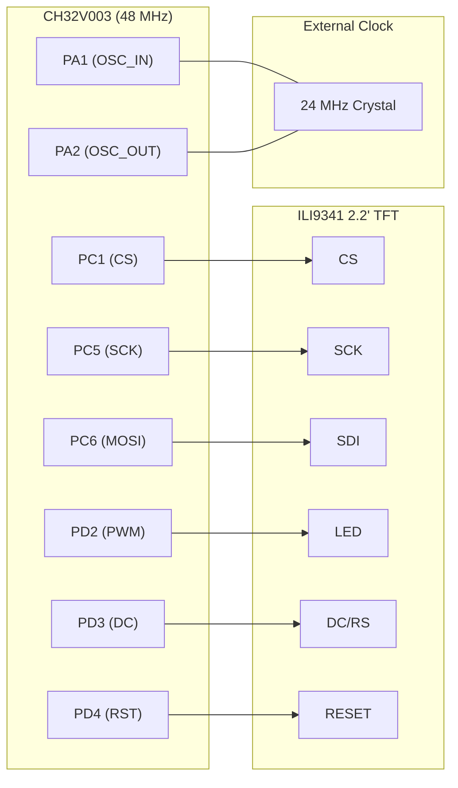

# Hardware — Connections & Wiring

## Wiring diagram


## Pin mapping table

| TFT Module Pin | CH32V003 Pin | Direction | GPIO Mode | Description |
|----------------|-------------|-----------|-----------|-------------|
| **VCC** | 3.3 V supply | — | — | Power (3.3 V only — do NOT use 5 V) |
| **GND** | GND | — | — | Common ground |
| **Crystal (X1)**| **PA1 / PA2**| IN/OUT | Analog      | 24 MHz External Crystal for 48 MHz Clock |
| **CS**         | **PC1**      | OUT    | Push-pull   | Chip-select (active LOW) |
| **RESET**      | **PD4**      | OUT    | Push-pull   | Hardware reset (active LOW) |
| **DC/RS**      | **PD3**      | OUT    | Push-pull   | Data/Command select (H=data, L=cmd) |
| **SDI/MOSI**   | **PC6**      | OUT    | AF-PP       | SPI1 MOSI |
| **SCK**        | **PC5**      | OUT    | AF-PP       | SPI1 clock |
| **LED**        | **PD2**      | OUT    | AF-PP       | Backlight PWM (TIM1_CH1) |
| **SDO/MISO**   | NC           | —      | —           | Not connected (write-only) |

> **Note:** The QVGA 2.2″ module has a 9-pin header.  
> Pin 1 is typically **VCC** and pin 9 is **SDO/MISO** — confirm with your board's silkscreen.

## CH32V003 GPIO register addresses used

| Register | Address | Purpose |
|----------|---------|---------|
| GPIOC CFGLR | `0x4001_1000` | Configure PC1/PC5/PC6 modes |
| GPIOC OUTDR | `0x4001_100C` | Drive PC1 (CS) high/low |
| GPIOD CFGLR | `0x4001_1400` | Configure PD2/PD3/PD4 modes |
| GPIOD OUTDR | `0x4001_140C` | Drive PD3 (DC) and PD4 (RST) |
| TIM1 CH1CVR | `0x4001_2C34` | Backlight PWM duty cycle (PD2) |

## CH32V003 package pinout reference (TSSOP20 / SOP16)

```
                 CH32V003 (TSSOP20)
                 ┌──────────┐
     PD4 (RST) ──┤ 1     20 ├── PC5 (SCK)   ← SPI1_SCK
     PD5       ──┤ 2     19 ├── PC6 (MOSI)  ← SPI1_MOSI
     PD6       ──┤ 3     18 ├── PC7
     PD7       ──┤ 4     17 ├── PC1 (CS)
     PA1 (OSCI)──┤ 5     16 ├── PC2         ← 24MHz Crystal (X1)
     PA2 (OSCO)──┤ 6     15 ├── PC3         ← 24MHz Crystal (X1)
     VSS (GND) ──┤ 7     14 ├── PC4
     PD1/SWDIO ──┤ 8     13 ├── PD0
     PD2 (LED) ──┤ 9     12 ├── VDD (3.3V)
     PD3 (DC)  ──┤ 10    11 ├── PA1
                 └──────────┘
```
> Pin numbers vary by package variant — always verify against your datasheet.
 
## Schematic Diagram (Logical)
 


## Electrical considerations

- **Clock source:** A 24 MHz external crystal (X1) is required to achieve the 48 MHz system clock (via x2 PLL multiplier).
- **Supply voltage:** 3.3 V strictly. The CH32V003 I/O is 3.3 V; most TFT modules accept 3.3 V directly.
- **SPI clock speed:** Set to 24 MHz (fPCLK/2). ILI9341 max write clock = 25 MHz.
- **Series resistor on MOSI/SCK:** Optional 22–33 Ω to reduce ringing on long wires.
- **Decoupling:** Place a 100 nF ceramic cap as close as possible to VCC/GND of both devices.
- **Backlight:** The LED pin draws ~20 mA at 3.3 V. A 33 Ω series resistor limits this safely.

## Required connections checklist

- [ ] VCC → 3.3 V
- [ ] GND → GND
- [ ] CS  → PC1
- [ ] RST → PD4
- [ ] DC  → PD3
- [ ] MOSI → PC6
- [ ] SCK → PC5
- [ ] LED → PD2 (PWM, with series resistor)
- [ ] MISO → NC (leave unconnected)
