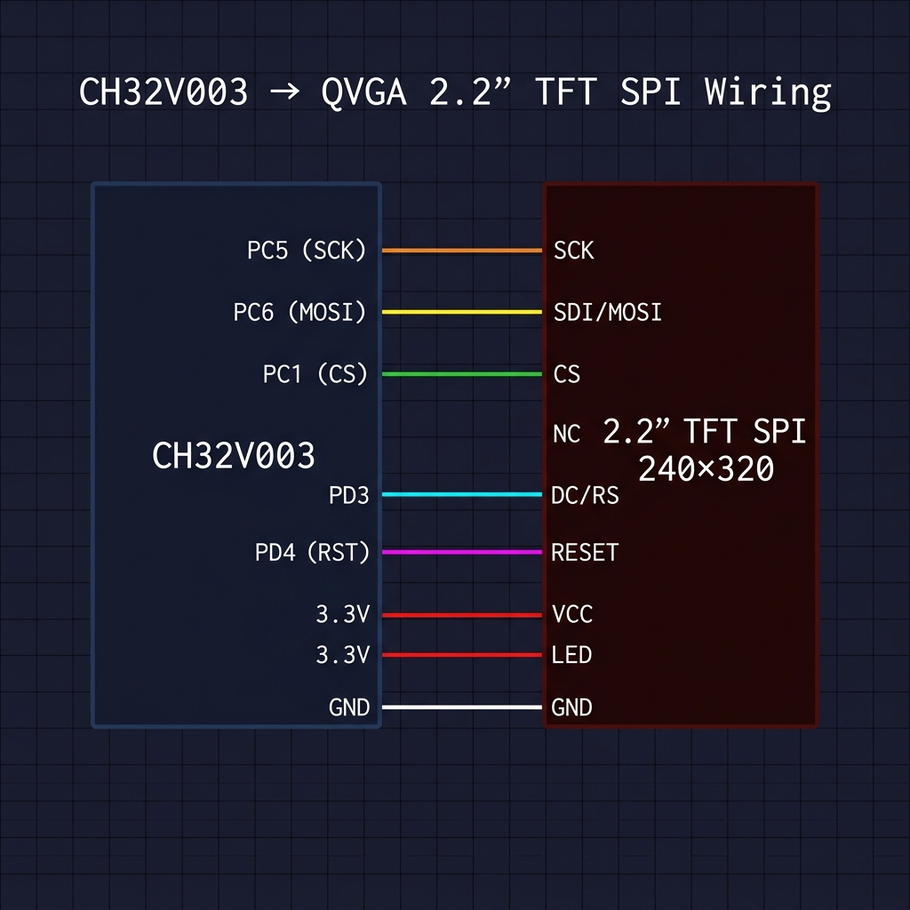

# Hardware — Connections & Wiring

## Wiring diagram



## Pin mapping table

| TFT Module Pin | CH32V003 Pin | Direction | GPIO Mode | Description |
|----------------|-------------|-----------|-----------|-------------|
| **VCC** | 3.3 V supply | — | — | Power (3.3 V only — do NOT use 5 V) |
| **GND** | GND | — | — | Common ground |
| **CS** | **PC1** | OUT | Push-pull 10 MHz | Chip-select (active LOW, software controlled) |
| **RESET** | **PD4** | OUT | Push-pull 10 MHz | Hardware reset (active LOW) |
| **DC/RS** | **PD3** | OUT | Push-pull 10 MHz | Data/Command select (HIGH=data, LOW=command) |
| **SDI/MOSI** | **PC6** | OUT | AF push-pull 50 MHz | SPI1 MOSI |
| **SCK** | **PC5** | OUT | AF push-pull 50 MHz | SPI1 clock |
| **LED** | 3.3 V (or PWM) | — | — | Backlight LED anode (add 10–33 Ω series resistor) |
| **SDO/MISO** | NC | — | — | Not connected (write-only driver) |

> **Note:** The QVGA 2.2″ module has a 9-pin header.  
> Pin 1 is typically **VCC** and pin 9 is **SDO/MISO** — confirm with your board's silkscreen.

## CH32V003 GPIO register addresses used

| Register | Address | Purpose |
|----------|---------|---------|
| GPIOC CFGLR | `0x4001_1000` | Configure PC1/PC5/PC6 modes |
| GPIOC OUTDR | `0x4001_100C` | Drive PC1 (CS) high/low |
| GPIOD CFGLR | `0x4001_1400` | Configure PD3/PD4 modes |
| GPIOD OUTDR | `0x4001_140C` | Drive PD3 (DC) and PD4 (RST) |

## CH32V003 package pinout reference (TSSOP20 / SOP16)

```
                 CH32V003 (TSSOP20)
                 ┌──────────┐
     PD4 (RST) ──┤ 1     20 ├── PC5 (SCK)   ← SPI1_SCK
     PD5       ──┤ 2     19 ├── PC6 (MOSI)  ← SPI1_MOSI
     PD6       ──┤ 3     18 ├── PC7
     PD7       ──┤ 4     17 ├── PC1 (CS)
     PA1/NRST  ──┤ 5     16 ├── PC2
     PA2       ──┤ 6     15 ├── PC3
     VSS (GND) ──┤ 7     14 ├── PC4
     PD1/SWDIO ──┤ 8     13 ├── PD0
     PD2       ──┤ 9     12 ├── VDD (3.3V)
     PD3 (DC)  ──┤ 10    11 ├── PA1
                 └──────────┘
```
> Pin numbers vary by package variant — always verify against your datasheet.

## Electrical considerations

- **Supply voltage:** 3.3 V strictly. The CH32V003 I/O is 3.3 V; most TFT modules accept 3.3 V directly.
- **SPI clock speed:** Set to 24 MHz (fPCLK/2). ILI9341 max write clock = 25 MHz.
- **Series resistor on MOSI/SCK:** Optional 22–33 Ω to reduce ringing on long wires.
- **Decoupling:** Place a 100 nF ceramic cap as close as possible to VCC/GND of both devices.
- **Backlight:** The LED pin draws ~20 mA at 3.3 V. A 33 Ω series resistor limits this safely.

## Required connections checklist

- [ ] VCC → 3.3 V
- [ ] GND → GND
- [ ] CS  → PC1
- [ ] RST → PD4
- [ ] DC  → PD3
- [ ] MOSI → PC6
- [ ] SCK → PC5
- [ ] LED → 3.3 V (with series resistor)
- [ ] MISO → NC (leave unconnected)
